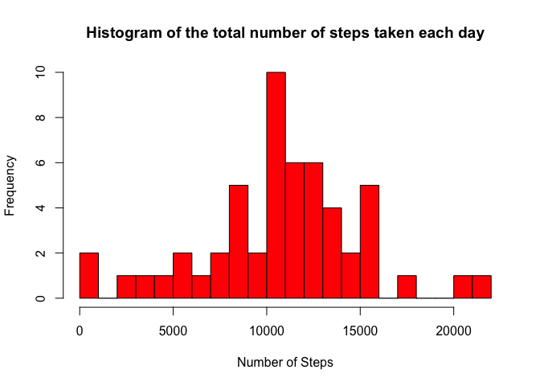
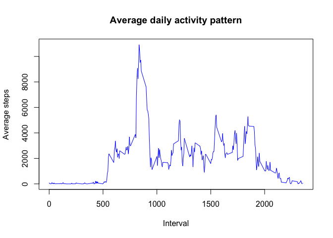
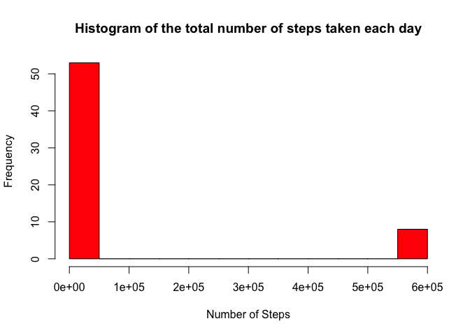
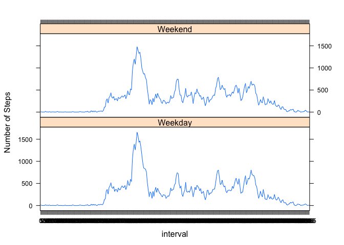

## Loading and preprocessing the data
## Load the data

```r
data <- read.csv("activity.csv",header = TRUE, sep = ",", na.strings = NA)
```
### observing the summary of the data

```r
summary(data)
```

```
##      steps                date          interval     
##  Min.   :  0.00   2012-10-01:  288   Min.   :   0.0  
##  1st Qu.:  0.00   2012-10-02:  288   1st Qu.: 588.8  
##  Median :  0.00   2012-10-03:  288   Median :1177.5  
##  Mean   : 37.38   2012-10-04:  288   Mean   :1177.5  
##  3rd Qu.: 12.00   2012-10-05:  288   3rd Qu.:1766.2  
##  Max.   :806.00   2012-10-06:  288   Max.   :2355.0  
##  NA's   :2304     (Other)   :15840
```
### observing the first few rows of the data & converting date to proper format

```r
head(data)
```

```
##   steps       date interval
## 1    NA 2012-10-01        0
## 2    NA 2012-10-01        5
## 3    NA 2012-10-01       10
## 4    NA 2012-10-01       15
## 5    NA 2012-10-01       20
## 6    NA 2012-10-01       25
```

```r
data$date <- as.Date(data$date, format = "%Y-%m-%d")
data$interval <- factor(data$interval)
```
## 1. What is mean total number of steps taken per day?
### removing NAs

```r
NA_index <- is.na(as.character(data$steps))
data_no_NA <- data[!NA_index,]
head(data_no_NA)
```

```
##     steps       date interval
## 289     0 2012-10-02        0
## 290     0 2012-10-02        5
## 291     0 2012-10-02       10
## 292     0 2012-10-02       15
## 293     0 2012-10-02       20
## 294     0 2012-10-02       25
```


```r
steps_each_day <- aggregate(steps ~ date, data = data_no_NA, sum)

colnames(steps_each_day) <- c("date", "steps")

head(steps_each_day)
```

```
##         date steps
## 1 2012-10-02   126
## 2 2012-10-03 11352
## 3 2012-10-04 12116
## 4 2012-10-05 13294
## 5 2012-10-06 15420
## 6 2012-10-07 11015
```

```r
class(steps_each_day$steps)
```

```
## [1] "integer"
```
###Build a histogram

```r
hist(as.numeric(steps_each_day$steps), breaks = 20, col = "red", xlab = "Number of Steps", main= "Histogram of the total number of steps taken each day")
```

<!-- -->

#Mean

```r
mean(steps_each_day$steps)
```

```
## [1] 10766.19
```


#Median

```r
median(steps_each_day$steps)
```

```
## [1] 10765
```

##2. What is the average daily activity pattern?


```r
head(data_no_NA)
```

```
##     steps       date interval
## 289     0 2012-10-02        0
## 290     0 2012-10-02        5
## 291     0 2012-10-02       10
## 292     0 2012-10-02       15
## 293     0 2012-10-02       20
## 294     0 2012-10-02       25
```

```r
steps_per_interval <- aggregate(steps ~ interval, data = data_no_NA, sum)
head(steps_per_interval)
```

```
##   interval steps
## 1        0    91
## 2        5    18
## 3       10     7
## 4       15     8
## 5       20     4
## 6       25   111
```

```r
colnames(steps_per_interval) <- c("interval","average_steps")
```
### Draw a plot with steps_per_interval

```r
plot(as.integer(levels(steps_per_interval$interval)), steps_per_interval$average_steps, type="l", xlab = "Interval", ylab = "Average steps", main = "Average daily activity pattern", col ="blue")
```

<!-- -->

### Which 5-minute interval, on average across all the days in the dataset, contains the maximum number of steps?

```r
intervale_max_steps<-steps_per_interval[which.max(steps_per_interval$average_steps),]$interval
intervale_max_steps
```

```
## [1] 835
## 288 Levels: 0 5 10 15 20 25 30 35 40 45 50 55 100 105 110 115 120 ... 2355
```


##3.  Imputing missing values
###checking missing values for all variables

```r
sum(is.na(as.character(data$steps)))
```

```
## [1] 2304
```

```r
sum(is.na(as.character(data$date)))
```

```
## [1] 0
```

```r
sum(is.na(as.character(data$interval)))
```

```
## [1] 0
```

#finding the indices of missing values (NAs) & imputing with mean of that 5 min interval

```r
NA_index <- which(is.na(as.character(data$steps)))
complete_data <- data
complete_data[NA_index, ]$steps<-unlist(lapply(NA_index, FUN=function(NA_index){
                steps_per_interval[data[NA_index,]$interval==steps_per_interval$interval,]$average_steps
                }))
```

###Checking the complete data with the summary and str methods & plotting the data

```r
summary(complete_data)
```

```
##      steps              date               interval    
##  Min.   :    0.0   Min.   :2012-10-01   0      :   61  
##  1st Qu.:    0.0   1st Qu.:2012-10-16   5      :   61  
##  Median :    0.0   Median :2012-10-31   10     :   61  
##  Mean   :  292.3   Mean   :2012-10-31   15     :   61  
##  3rd Qu.:   43.0   3rd Qu.:2012-11-15   20     :   61  
##  Max.   :10927.0   Max.   :2012-11-30   25     :   61  
##                                         (Other):17202
```

```r
str(complete_data)
```

```
## 'data.frame':	17568 obs. of  3 variables:
##  $ steps   : int  91 18 7 8 4 111 28 46 0 78 ...
##  $ date    : Date, format: "2012-10-01" "2012-10-01" ...
##  $ interval: Factor w/ 288 levels "0","5","10","15",..: 1 2 3 4 5 6 7 8 9 10 ...
```

```r
steps_each_day_complete <- aggregate(steps ~ date, data = complete_data, sum)
colnames(steps_each_day_complete) <- c("date", "steps")
hist(as.numeric(steps_each_day_complete$steps), breaks = 20, col = "red", xlab = "Number of Steps", main= "Histogram of the total number of steps taken each day")
```

<!-- -->
###mean & median

```r
mean(steps_each_day_complete$steps)
```

```
## [1] 84188.07
```

```r
median(steps_each_day_complete$steps)
```

```
## [1] 11458
```
###We notice that the mean of the complete dataset (10766) is equal to the mean of the dataset without missing values. The median of the complete dataset has shifted from 10765 to 10766. Therefore, the mean and median for the complete dataset are almost identical.


##4.  Are there differences in activity patterns between weekdays and weekends?

#Creating a factor variable "day "to store the day of the week:

```r
complete_data$day <- as.factor(weekdays(complete_data$date))
```
#Creating a logical variable "is_weekday" (weekday=TRUE, weekend = FALE) :

```r
complete_data$is_weekday <- ifelse(!(complete_data$day %in% c("Saturday","Sunday")), TRUE, FALSE) 
```
#Calculating the average number of steps for weekdays

```r
weekdays_data <- complete_data[complete_data$is_weekday,]
steps_per_interval_weekdays <- aggregate(weekdays_data$steps, by=list(interval=weekdays_data$interval), FUN=mean)
```
#Calculating the average number of steps for weekends

```r
weekends_data <- complete_data[!complete_data$is_weekday,]
steps_per_interval_weekends <- aggregate(weekends_data$steps, by=list(interval=weekends_data$interval), FUN=mean)
```
#Adding columns names

```r
colnames(steps_per_interval_weekdays) <- c("interval", "average_steps")
colnames(steps_per_interval_weekends) <- c("interval", "average_steps")
```
#Adding a column to indecate the day

```r
steps_per_interval_weekdays$day <- "Weekday"
steps_per_interval_weekends$day <- "Weekend"
```
#Merging the two togather

```r
week_data <- rbind(steps_per_interval_weekends, steps_per_interval_weekdays)
```
#Converting the day variabke to a factor

```r
week_data$day <- as.factor(week_data$day)
```
#Making the plot

```r
library(lattice)
xyplot(average_steps ~  interval | day, data = week_data, layout = c(1,2), type ="l", ylab="Number of Steps")
```

<!-- -->
